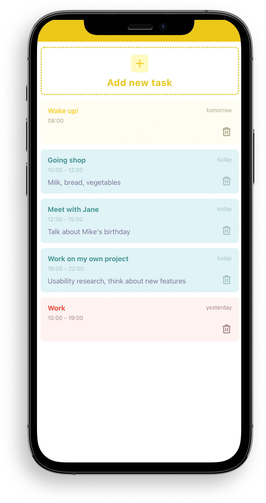

### What is this?

##### This is a my test project with React.

#####  

------------

### Technologies

- ##### [React JS](https://github.com/facebook/react "React JS")
- ##### [Create react app](https://github.com/facebook/create-react-app)
- ##### [Mozaik JS](https://github.com/FireworksX/mozaik)
- ##### [Day JS](https://github.com/iamkun/dayjs)

------------

### Why did I do this project? 🧐

##### Often if you learning any technology, you need to start with something simple. When I started to learning ReactJS I decided to make TODO list. Because it,s functionality is enough to learn basics of most of technologies.
